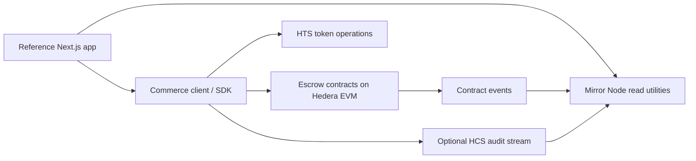

# Architecture

## Purpose and users

Hedera Commerce Rail is a reusable Scaffold HBAR starting point for developers building commerce and payment applications. Its reference scenario is service-provider work paid through escrow with milestone approvals, release/refund paths, and an inspectable audit history. The underlying payment primitives should remain independent of that scenario. The intended first network is Hedera Testnet.

## Current foundation

The repository follows the official Scaffold HBAR monorepo layout. Milestone 1 selects the upstream blank template's Next.js frontend and Hardhat Solidity workspace. The upstream sample HTS contracts and demo UI are starter material only; they do not implement the Commerce Rail product.

```text
packages/
  nextjs/       Next.js App Router, wallet integration, Scaffold HBAR UI
  hardhat/      Solidity workspace, deploy scripts, and upstream example tests
docs/           Architecture, roadmap, and development journal
```

The Scaffold HBAR CLI supports the framework and package-manager options declared in `template.json` upstream. Community templates are downloaded from GitHub repositories/refs, so the intended scaffold command depends on this repository being published and publicly accessible.

## Planned system boundaries



The diagram describes planned boundaries, not implemented Milestone 1 behavior. Core contract/client APIs should be reusable, while screens and example workflows remain in the reference application. HBAR settlement and HTS token handling must be explicit asset paths, with token association/allowance requirements surfaced to users where applicable. Contract events are the canonical on-chain state transitions; HCS is an optional application audit stream rather than the source of escrow state. Mirror Node utilities are read-only projections and must handle indexing delay.

## Hedera services and contract design

- **Hedera EVM / Solidity:** Planned escrow state machine for creation, funding, milestone release, completion, deadline handling, and refunds. Access rules and dispute resolution need explicit product decisions before contract implementation.
- **HTS:** Planned token-payment support using current Hedera-supported EVM/SDK interfaces. The exact transfer path and token-association behavior will be validated against official docs in the relevant milestone.
- **HCS:** Planned optional audit messages with a versioned event schema. Secrets and unnecessary personal data must never enter messages.
- **Mirror Node:** Planned read-only transaction, event, and HCS history support. No API integration exists yet.

The upstream starter currently includes sample ERC-20 and HTS token creation contracts. They are not Commerce Rail contracts and should be replaced or retained only if later product design gives them a clear role. Milestone 1 adds no payment contracts.

## Frontend and developer tooling

The frontend is the upstream Scaffold HBAR Next.js App Router package with its wallet providers and contract debugging components. The Hardhat package provides Solidity compilation, tests, and deploy scripts. The CLI template manifest will advertise only configurations that the template can genuinely support. No separate backend or database is planned at this stage.

## Testing and deployment

The target test layers are isolated contract unit tests, local Hedera-fork tests where HTS semantics require them, client tests, and a later Testnet smoke check with an explicitly configured test account. Milestone 1 preserves upstream workflows and does not deploy. Future deployments must be opt-in and network-specific; local development and automated tests must not require a funded production account.

## Environment and security assumptions

Credentials are local-only and loaded from ignored environment files or a secure runtime secret source. The `.env.example` contains placeholders only. No private key is committed. The starter's configuration and test defaults will be reviewed and hardened in the Hedera connection/security milestones before real Testnet usage. Milestone 1 performs no signing or network transactions.

## Extensibility and scope

Future payment APIs should keep policy evaluation separate from transaction execution so an optional AgentPay module can apply limits and recipient/asset allowlists without changing escrow invariants. AgentPay, backend services, persistent storage, production operations, and public deployment are explicitly out of scope for Milestone 1.
