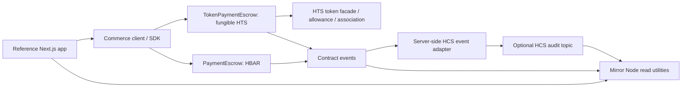
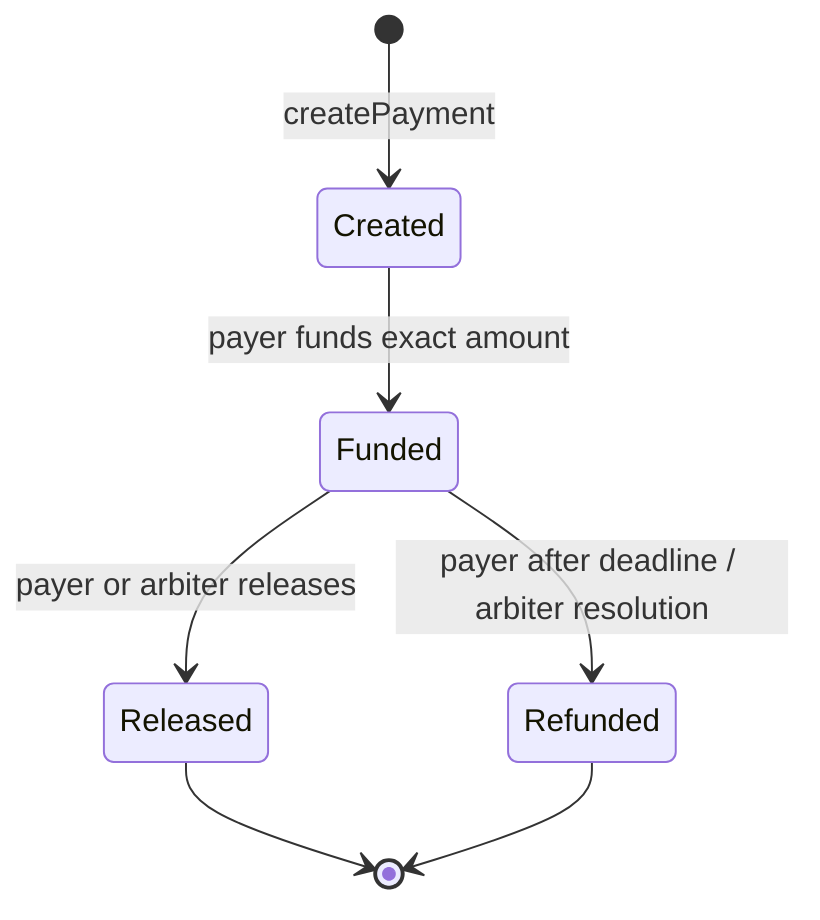

# Architecture

## Purpose and users

Hedera Commerce Rail is a reusable Scaffold HBAR starting point for developers building commerce and payment applications. Its reference scenario is service-provider work paid through escrow with milestone approvals, release/refund paths, and an inspectable audit history. The underlying payment primitives should remain independent of that scenario. The intended first network is Hedera Testnet.

## Current foundation

The repository follows the official Scaffold HBAR monorepo layout. Milestone 1 selects the upstream blank template's Next.js frontend and Hardhat Solidity workspace. The upstream sample HTS contracts and demo UI are starter material only; they do not implement the Commerce Rail product.

```text
packages/
  nextjs/       Next.js App Router, wallet integration, Scaffold HBAR UI
  hardhat/      Solidity workspace, deploy scripts, and upstream example tests
  sdk/          server-side Commerce SDK; composes the rails and M5/M6 adapters
docs/           Architecture, roadmap, and development journal
```

## Hedera connection layer (Milestone 2)

`packages/hardhat/lib/hedera/config.ts` centralizes the local, Testnet, and Mainnet network metadata and provides environment parsing plus a Hiero SDK `Client` factory. The browser continues to use Scaffold HBAR's Wagmi/Viem wallet and chain configuration; the SDK client is server-side and does not replace that wallet layer. RPC endpoint defaults align with the Scaffold HBAR configuration. Local SDK access targets a running local-node service; the browser/Hardhat local EVM fork remains a separate JSON-RPC interface.

Set `HEDERA_NETWORK=local` for SDK construction without credentials when a Hedera Local Node service is running. This is distinct from Scaffold HBAR's `npm run hardhat:chain`, which runs a forked EVM JSON-RPC node and is used by the contract tests. Testnet and Mainnet require both `HEDERA_ACCOUNT_ID` and `HEDERA_PRIVATE_KEY`; malformed/missing values fail with actionable messages and secret values are not included. Hardhat live networks have no default signing account: set `HEDERA_PRIVATE_KEY` or use the existing encrypted account deploy command. `HEDERA_RPC_URL` optionally overrides the Hardhat EVM fork provider URL. No Mirror Node business client is added in this milestone. The optional read-only connectivity test is enabled with `HEDERA_TESTNET_INTEGRATION=true npm test`; the default suite skips it.

The Scaffold HBAR CLI supports the framework and package-manager options declared in `template.json` upstream. Community templates are downloaded from GitHub repositories/refs, so the intended scaffold command depends on this repository being published and publicly accessible.

## Planned system boundaries



The diagram shows system boundaries. HBAR and HTS use separate escrow contracts so native-value funding semantics remain stable. Contract events are the canonical on-chain state transitions; HCS is an optional application audit stream rather than the source of escrow state. Mirror Node utilities are read-only projections and must handle indexing delay.

## Milestone 7 — Commerce SDK

`packages/sdk` is the server-side typed developer interface. It uses the Hardhat deployment JSON artifacts as its ABI/address metadata source and wraps the existing M5 event normalization/HCS publisher and M6 Mirror Node client/correlation functions. Those implementation modules now live behind SDK internal adapters; established Hardhat import paths remain compatibility re-exports. No second schema, publisher, or Mirror Node HTTP client is introduced. SDK callers provide explicit network-specific RPC signer and escrow addresses; HCS and Mirror Node remain optional. HBAR amounts remain tinybars (converted to Ethers' weibars only for transaction value); HTS amounts remain token smallest units. Settlement calls check stored payment asset/amount and wait for a successful receipt. HCS publication remains independent of settlement.

## Milestone 3 — native HBAR escrow

`packages/hardhat/contracts/PaymentEscrow.sol` is the first Commerce Rail contract. It keeps creation separate from funding and handles only native HBAR. Each payment stores payer, payee, optional arbiter, amount, asset (`address(0)` for HBAR), creation time, deadline, and state. Amount is the EVM-visible tinybar unit. Hedera Ethers transaction values use weibars: one tinybar is represented by `10^10` weibars, or `10^18` for one HBAR.



The payer creates and funds an agreement. Only the payer or configured arbiter can release or refund it. The payer's refund path opens strictly after the deadline (`block.timestamp > deadline`); the arbiter can resolve immediately. A zero arbiter disables arbitration. Release transfers to the payee, refund transfers to the payer. The contract rejects direct unaccounted deposits and tracks `totalEscrowed`; forced HBAR sent outside the EVM call path is surplus and is not counted as payment funds.

OpenZeppelin `ReentrancyGuard` protects value settlement. Each operation validates, updates state and liabilities, then makes a checked low-level value transfer. A failed recipient transfer reverts the whole settlement. `PaymentCreated`, `PaymentFunded`, `PaymentReleased`, and `PaymentRefunded` use indexed payment IDs and party addresses, include the HBAR asset marker and amount, and can be consumed by later indexers. They are EVM logs and do not depend on HCS.

The deployment script is tagged `PaymentEscrow`; opt-in Testnet deployment is `npm run hardhat:deploy -- --network hederaTestnet --tags PaymentEscrow`. The existing Hardhat config requires an explicitly configured signing key and uses chain ID 296/Testnet RPC settings. The M3.5 live deployment is recorded below; builds and default tests never deploy. Default tests run against the configured local Hedera EVM fork and need no Testnet credentials.

### Milestone 3.5 Testnet checkpoint

The Testnet ECDSA key is configured only in the ignored repository-root `.env`; the Hardhat deployment wrapper and config load that file from the workspace correctly. The ECDSA account is used for EVM signing. ED25519 credentials are not used. The M3 contract is deployed at `0x85a038f7FB8E01EBD6F0E5B02791E57Bfb6aa260` (`0.0.10842321`) on chain ID 296. Transaction `0xb8dedb6bd8cf23ae03496594e15bb4f887a8b9e20d5b86f081f4ef06f15f1c13` succeeded on 2026-10-03 at 13:09:42 UTC. Mirror Node returned the contract/transaction records, and Testnet JSON-RPC returned 3,424 bytes of runtime code. No HBAR payment flow was exercised.

### Future asset and audit extensions

- **HTS:** `TokenPaymentEscrow` handles only fungible HTS tokens via their ERC-20-compatible token facade. It records the token EVM address (the Solidity-facing representation of Hedera's token ID), payer, payee, arbiter, amount in smallest units, deadline and state. It checks exact token balance deltas on funding and settlement, consumes an explicit payer allowance, tracks escrow liabilities per token, and applies reentrancy protection. Tokens are not interchangeable with HBAR or arbitrary ERC-20 contracts by assumption; integrators remain responsible for token policy/trust.
- **Association:** Each account/contract must have a token relationship before it receives an HTS token. The escrow exposes `associateToken` and calls the token's HIP-719 association facade as itself. The payer and payee associate from their own accounts before funding/release; payer approval is a separate ERC-20-compatible allowance step. Association and allowance are independent requirements. Testnet validated both contract self-association paths. The local fork cannot emulate this for newly deployed contracts: its `0x167` HIP-719 route requires a Hedera entity mapping, which local EVM deployments do not have.
- **HCS:** Implemented as an optional, server-side publisher. The contract logs remain authoritative; the adapter never runs inside Solidity settlement and no payment call waits on HCS.
- **Mirror Node:** Read-only transaction, event, and HCS history support is implemented in M6, described below.

The upstream HTS token-creation example remains a token provisioning utility, separate from both escrow contracts. Payment events carry stable IDs and state transition data consumed by the M6 Mirror Node adapter and M5 HCS correlation.

## Milestone 5 — HCS audit/event integration

`packages/hardhat/lib/hcs/schema.ts` defines schema version 1 for `payment.created`, `payment.funded`, `payment.released`, and `payment.refunded`. The envelope uses decimal strings for payment IDs, amounts, and source EVM block numbers to avoid JSON number precision loss. `assetType` is `HBAR` with `assetId: null`, or `HTS_FUNGIBLE` with the Solidity-facing HTS token EVM address. It includes payer/payee, originating escrow, Hedera network, source transaction hash, source block, log index, occurrence time, and scalar-only metadata. It rejects unknown event kinds, malformed required fields, invalid asset forms, schema versions, and messages over 1,024 UTF-8 bytes.

Canonical JSON shape:

```json
{
  "schemaVersion": 1,
  "eventId": "0x<sha256>",
  "eventType": "payment.funded",
  "paymentId": "12",
  "assetType": "HTS_FUNGIBLE",
  "assetId": "0x<40-hex-token-evm-address>",
  "payer": "0x<40-hex-address>",
  "payee": "0x<40-hex-address>",
  "amount": "1000000",
  "contractAddress": "0x<40-hex-address>",
  "network": "hedera-testnet",
  "sourceTxHash": "0x<64-hex-transaction-hash>",
  "sourceBlockNumber": "41308701",
  "sourceLogIndex": 2,
  "occurredAt": "2026-10-03T14:58:49.000Z",
  "metadata": {}
}
```

For HBAR, `assetType` is `HBAR` and `assetId` is JSON `null`.

The `eventId` is SHA-256 over `network:lowercase(sourceTxHash):lowercase(contractAddress):sourceLogIndex`. Those source coordinates come from the actual EVM receipt and are sufficient to reconstruct identity. Payment ID is payload context, not part of identity; EVM log index distinguishes multiple logs in one transaction. HCS does not enforce uniqueness. The publisher suppresses concurrent duplicate attempts and repeats within one process, but there is no durable outbox or cross-process deduplication store in this scaffold. Submission is therefore at-least-once when callers retry an ambiguous timeout; consumers should deduplicate by `eventId`. The HCS message response returns its HCS transaction ID and topic sequence number; consensus timestamp is available from the Mirror Node adapter described below.

`normalizeEscrowLog` maps the existing `Payment*` and `TokenPayment*` events to the stable event names. The caller supplies the event's confirmed EVM receipt coordinates and the payment terms resolved from the contract at that source block; this enriches lifecycle events such as `PaymentFunded` that do not repeat the payee. It rejects unknown event names and mismatched payment IDs. It does not maintain a second payment state machine.

### Topic provisioning and runtime configuration

The developer provisions one topic per application/environment and supplies its topic ID at runtime (`HCS_TOPIC_ID`); the scaffold does not create topics at app startup. `npm run hcs:topic:create -w @sh/hardhat` is a one-time, Testnet-only command. It requires the existing `HEDERA_NETWORK=testnet`, `HEDERA_ACCOUNT_ID`, and `HEDERA_PRIVATE_KEY`, creates a topic with the M5 schema memo (marked public by default, private when a submit key is supplied), and prints the resulting topic ID and create transaction ID. The command refuses to create a topic when `HCS_TOPIC_ID` is already configured, so the existing topic is reused. `npm run hcs:smoke -w @sh/hardhat` is an explicit Testnet-only validation action. The `@hiero-ledger/sdk` package already used by the project supplies `TopicCreateTransaction`, `TopicMessageSubmitTransaction`, topic IDs, and receipts.

The provisioned M5 topic has no admin key and no submit key. Hedera defines an absent submit key as open submission to all accounts, and an absent admin key as no administrative update/delete authority (the topic cannot be deleted; expiration can be extended). The topic memo and message payload are public. For a private topic, set the optional `HCS_TOPIC_SUBMIT_KEY` public key when provisioning; the runtime `HEDERA_PRIVATE_KEY` must match it. The topic ID, network, operator credentials, and opt-in `HCS_ALLOW_MAINNET=true` gate are environment configuration. Mainnet publishing is disabled by default, while topic creation is restricted to Testnet.

Each message submission is an HCS transaction paid by the configured operator and incurs standard network fees; topic custom fees are not configured by this scaffold. HCS preserves per-topic message sequencing and the Mirror Node exposes messages by topic, sequence, and consensus timestamp. There is no private data or credential field in the canonical schema. Metadata is optional and must not carry secrets, personal data, or sensitive application content; a public topic is immutable after submission.

The implementation follows Hedera's current [topic creation guidance](https://docs.hedera.com/native/consensus/create-topic), [message submission guidance](https://docs.hedera.com/native/consensus/submit-message), and [Mirror Node topic API reference](https://docs.hedera.com/reference/rest-api/topics). The official SDK examples use `TopicCreateTransaction` / `TopicMessageSubmitTransaction`, with the created topic ID and submitted sequence number returned in transaction receipts. HCS charges a standard network fee per submitted transaction; custom topic fees can also apply, but this scaffold does not configure them.

The publisher fails explicitly on invalid config, invalid topic IDs, invalid payloads, SDK precheck/receipt failures, and network errors. It has no separate retry queue: callers may retry after an error, but an error after network acceptance is ambiguous and can result in duplicate HCS records. This failure does not reverse contract state. Applications needing durable eventual publication need an external persistent outbox and consumer deduplication; no database, Redis, or queue was added to this scaffold. See the development log for the Testnet validation, including the observed duplicate after an RPC reset.

## Milestone 6 — Mirror Node integration

`packages/hardhat/lib/mirror-node/client.ts` is a reusable server-side adapter built on standard `fetch`; no dependency was added. It requires `HEDERA_NETWORK=testnet` or `mainnet`, uses the corresponding official Mirror Node origin by default, and accepts an optional administrator-configured HTTPS origin in `MIRROR_NODE_BASE_URL`. URLs supplied to individual queries are never accepted. Redirect/page links are constrained to the configured origin and `/api/v1/` path. The optional `HCS_TOPIC_ID` supplies the default topic query; callers can pass a topic ID directly. Local EVM fork is not a Mirror Node network and has no default REST endpoint.

Implemented operations are:

- `getAccount`: account ID, EVM address, deletion flag, and current tinybar balance.
- `getContract`: contract ID/address, deployed EVM address, deleted flag, creation time, and bytecode.
- `getTransaction`: normalized result for a Hedera transaction ID (`shard.realm.account@seconds.nanoseconds`), converted to the Mirror Node path form.
- `getContractResults`: contract execution result by Hedera transaction ID or Ethereum transaction hash, including consensus timestamp and decoded Commerce Rail event logs.
- `getContractLogs`: one `getPage(next?)` at a time or `getAll()` bounded by a caller limit.
- `getTopicMessage` and `getTopicMessages`: one sequence or paged history, base64-decoded payload, existing schema-v1 event when valid, sequence, consensus timestamp, payer, and transaction ID recovered from HCS `chunk_info` when present.
- `getToken`: HTS ID, token metadata, and Solidity-facing EVM token address derived from the numeric token ID when the API does not provide one.

Normalized values retain `network` and raw source JSON, plus transaction/hash, contract/topic/token coordinates, status, log index, and exact consensus timestamp strings. Mirror Node timestamps are seconds with fractional nanoseconds; the adapter preserves the returned string. Large JSON integers are retained as decimal strings to avoid JavaScript precision loss. `eventId` parsing delegates to the M5 schema—there is no second identity rule. `locateSettlementEvent` queries the transaction's contract result and looks for the exact source transaction hash, contract address, and log index. It returns a located Mirror Node record and does not prove chain finality or cryptographic inclusion. `locateHcsEvent` retrieves by topic sequence or scans a caller-bounded message range and matches the existing event ID. `correlateCommerceEvent` reports whether HCS and event source coordinates match. A missing result means not found in that Mirror Node response at query time; indexing delay, pruning/retention, or upstream availability may be involved. None of these API observations can mark a payment settled. Contract state and contract execution remain authoritative.

Collection calls use Mirror Node `links.next` rather than offset assumptions, expose both page and bounded all-pages methods, cap per-page size at 100, caller total at 10,000 and all-pages safety at 100 pages. No automatic retries are performed. `MirrorNodeError` distinguishes `NOT_FOUND` (HTTP 404), `INVALID_REQUEST` (400), `RATE_LIMITED` (429, retaining `Retry-After`), `UPSTREAM_ERROR` (5xx, malformed data, network/JSON failures), and `CONFIGURATION_ERROR`. Respect 429, keep reads bounded, and account for public endpoint throttling. Do not present HTTP correlation as cryptographic verification.

The M6 implementation follows the current official [Mirror Node REST API overview and network endpoints](https://docs.hedera.com/reference/rest-api), [contract API](https://docs.hedera.com/reference/rest-api/contracts) and [specific contract result API](https://docs.hedera.com/api-reference/contracts/get-the-contract-result-from-a-contract-on-the-network-for-a-given-transactionid-or-ethereum-transaction-hash), [topic API](https://docs.hedera.com/reference/rest-api/topics), plus the [account](https://docs.hedera.com/reference/rest-api/accounts), [token](https://docs.hedera.com/reference/rest-api/tokens), and [transaction](https://docs.hedera.com/reference/rest-api/transactions) references. Official docs currently list a 50 request/second public Mainnet limit per IP; limits can change. Current API response contracts include 400/404 and contract results can return partial-content 206; the normalized `partial` flag preserves this response condition. 429 and 5xx are surfaced without retry loops. See the M6 development log for current Testnet validation against the M3/M4 contracts and M5 HCS evidence.

## Frontend and developer tooling

The frontend is the upstream Scaffold HBAR Next.js App Router package with its wallet providers and contract debugging components. The Hardhat package provides Solidity compilation, tests, and deploy scripts. The CLI template manifest will advertise only configurations that the template can genuinely support. No separate backend or database is planned at this stage.

## Testing and deployment

The Hardhat unit tests exercise escrow lifecycle semantics using token doubles and the local fork diagnostic identifies its entity-mapping limitation. The separate Testnet M4.1 smoke run exercised actual HTS association and settlement with token `0.0.10843331`; `TokenPaymentEscrow` is deployed at `0xa1069144BAc92E69634F8af332C92d053d9e72bb` (`0.0.10843288`). See the development log for transaction evidence and final balances. Deployments and future smoke runs must remain opt-in and network-specific; local development and automated tests do not require a funded network account.

## Environment and security assumptions

Credentials are local-only and loaded from ignored environment files or a secure runtime secret source. The `.env.example` contains placeholders only. No private key is committed. The starter's configuration and test defaults will be reviewed and hardened in the Hedera connection/security milestones before real Testnet usage. Milestone 1 performs no signing or network transactions.

## Extensibility and scope

Future payment APIs should keep policy evaluation separate from transaction execution so an optional AgentPay module can apply limits and recipient/asset allowlists without changing escrow invariants. AgentPay, backend services, persistent storage, production operations, and public deployment are explicitly out of scope for Milestone 1.
