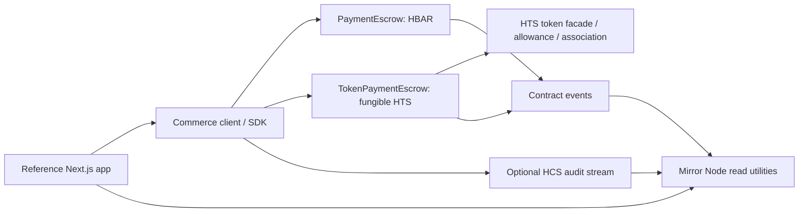
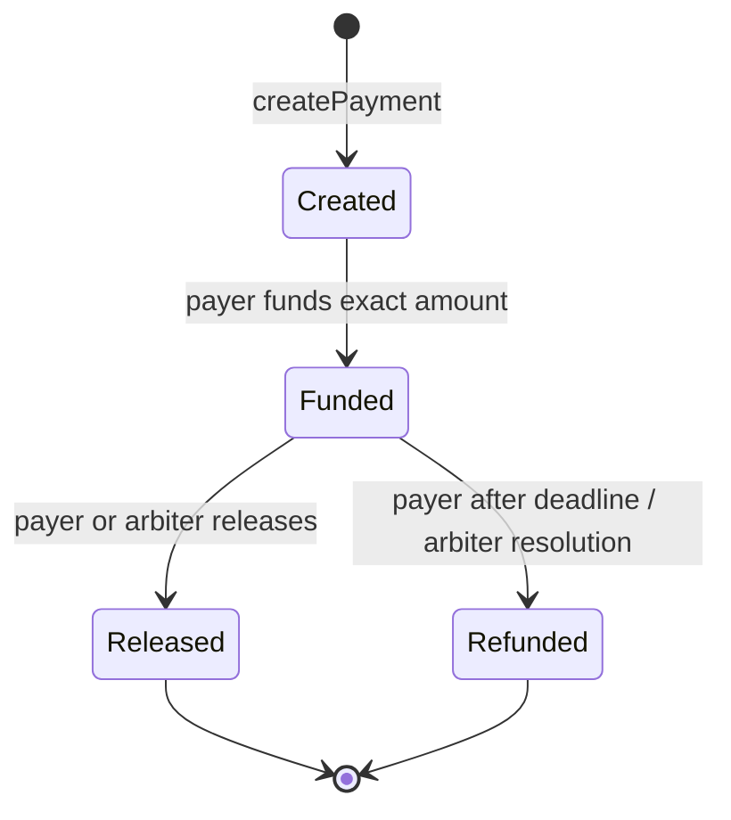

# Architecture

## Purpose and users

Hedera Commerce Rail is a reusable Scaffold HBAR starting point for developers building commerce and payment applications. Its reference scenario is service-provider work paid through escrow with milestone approvals, release/refund paths, and an inspectable audit history. The underlying payment primitives should remain independent of that scenario. The intended first network is Hedera Testnet.

## Current foundation

The repository follows the official Scaffold HBAR monorepo layout. Milestone 1 selects the upstream blank template's Next.js frontend and Hardhat Solidity workspace. The upstream sample HTS contracts and demo UI are starter material only; they do not implement the Commerce Rail product.

```text
packages/
  nextjs/       Next.js App Router, wallet integration, Scaffold HBAR UI
  hardhat/      Solidity workspace, deploy scripts, and upstream example tests
docs/           Architecture, roadmap, and development journal
```

## Hedera connection layer (Milestone 2)

`packages/hardhat/lib/hedera/config.ts` centralizes the local, Testnet, and Mainnet network metadata and provides environment parsing plus a Hiero SDK `Client` factory. The browser continues to use Scaffold HBAR's Wagmi/Viem wallet and chain configuration; the SDK client is server-side and does not replace that wallet layer. RPC endpoint defaults align with the Scaffold HBAR configuration. Local SDK access targets a running local-node service; the browser/Hardhat local EVM fork remains a separate JSON-RPC interface.

Set `HEDERA_NETWORK=local` for SDK construction without credentials when a Hedera Local Node service is running. This is distinct from Scaffold HBAR's `npm run hardhat:chain`, which runs a forked EVM JSON-RPC node and is used by the contract tests. Testnet and Mainnet require both `HEDERA_ACCOUNT_ID` and `HEDERA_PRIVATE_KEY`; malformed/missing values fail with actionable messages and secret values are not included. Hardhat live networks have no default signing account: set `HEDERA_PRIVATE_KEY` or use the existing encrypted account deploy command. `HEDERA_RPC_URL` optionally overrides the Hardhat EVM fork provider URL. No Mirror Node business client is added in this milestone. The optional read-only connectivity test is enabled with `HEDERA_TESTNET_INTEGRATION=true npm test`; the default suite skips it.

The Scaffold HBAR CLI supports the framework and package-manager options declared in `template.json` upstream. Community templates are downloaded from GitHub repositories/refs, so the intended scaffold command depends on this repository being published and publicly accessible.

## Planned system boundaries



The diagram shows system boundaries. HBAR and HTS use separate escrow contracts so native-value funding semantics remain stable. Contract events are the canonical on-chain state transitions; HCS is an optional application audit stream rather than the source of escrow state. Mirror Node utilities are read-only projections and must handle indexing delay.

## Milestone 3 — native HBAR escrow

`packages/hardhat/contracts/PaymentEscrow.sol` is the first Commerce Rail contract. It keeps creation separate from funding and handles only native HBAR. Each payment stores payer, payee, optional arbiter, amount, asset (`address(0)` for HBAR), creation time, deadline, and state. Amount is the EVM-visible tinybar unit. Hedera Ethers transaction values use weibars: one tinybar is represented by `10^10` weibars, or `10^18` for one HBAR.



The payer creates and funds an agreement. Only the payer or configured arbiter can release or refund it. The payer's refund path opens strictly after the deadline (`block.timestamp > deadline`); the arbiter can resolve immediately. A zero arbiter disables arbitration. Release transfers to the payee, refund transfers to the payer. The contract rejects direct unaccounted deposits and tracks `totalEscrowed`; forced HBAR sent outside the EVM call path is surplus and is not counted as payment funds.

OpenZeppelin `ReentrancyGuard` protects value settlement. Each operation validates, updates state and liabilities, then makes a checked low-level value transfer. A failed recipient transfer reverts the whole settlement. `PaymentCreated`, `PaymentFunded`, `PaymentReleased`, and `PaymentRefunded` use indexed payment IDs and party addresses, include the HBAR asset marker and amount, and can be consumed by later indexers. They are EVM logs and do not depend on HCS.

The deployment script is tagged `PaymentEscrow`; opt-in Testnet deployment is `npm run hardhat:deploy -- --network hederaTestnet --tags PaymentEscrow`. The existing Hardhat config requires an explicitly configured signing key and uses chain ID 296/Testnet RPC settings. The M3.5 live deployment is recorded below; builds and default tests never deploy. Default tests run against the configured local Hedera EVM fork and need no Testnet credentials.

### Milestone 3.5 Testnet checkpoint

The Testnet ECDSA key is configured only in the ignored repository-root `.env`; the Hardhat deployment wrapper and config load that file from the workspace correctly. The ECDSA account is used for EVM signing. ED25519 credentials are not used. The M3 contract is deployed at `0x85a038f7FB8E01EBD6F0E5B02791E57Bfb6aa260` (`0.0.10842321`) on chain ID 296. Transaction `0xb8dedb6bd8cf23ae03496594e15bb4f887a8b9e20d5b86f081f4ef06f15f1c13` succeeded on 2026-10-03 at 13:09:42 UTC. Mirror Node returned the contract/transaction records, and Testnet JSON-RPC returned 3,424 bytes of runtime code. No HBAR payment flow was exercised.

### Future asset and audit extensions

- **HTS:** `TokenPaymentEscrow` handles only fungible HTS tokens via their ERC-20-compatible token facade. It records the token EVM address (the Solidity-facing representation of Hedera's token ID), payer, payee, arbiter, amount in smallest units, deadline and state. It checks exact token balance deltas on funding and settlement, consumes an explicit payer allowance, tracks escrow liabilities per token, and applies reentrancy protection. Tokens are not interchangeable with HBAR or arbitrary ERC-20 contracts by assumption; integrators remain responsible for token policy/trust.
- **Association:** Each account/contract must have a token relationship before it receives an HTS token. The escrow exposes `associateToken` and calls the token's HIP-719 association facade as itself. The payer and payee associate from their own accounts before funding/release; payer approval is a separate ERC-20-compatible allowance step. Association and allowance are independent requirements. Testnet validated both contract self-association paths. The local fork cannot emulate this for newly deployed contracts: its `0x167` HIP-719 route requires a Hedera entity mapping, which local EVM deployments do not have.
- **HCS:** Planned optional audit messages with a versioned event schema. Secrets and unnecessary personal data must never enter messages.
- **Mirror Node:** Planned read-only transaction, event, and HCS history support. No API integration exists yet.

The upstream HTS token-creation example remains a token provisioning utility, separate from both escrow contracts. Payment events carry stable IDs and state transition data for future Mirror Node indexing and optional HCS correlation. M5 and later remain unstarted.

## Frontend and developer tooling

The frontend is the upstream Scaffold HBAR Next.js App Router package with its wallet providers and contract debugging components. The Hardhat package provides Solidity compilation, tests, and deploy scripts. The CLI template manifest will advertise only configurations that the template can genuinely support. No separate backend or database is planned at this stage.

## Testing and deployment

The Hardhat unit tests exercise escrow lifecycle semantics using token doubles and the local fork diagnostic identifies its entity-mapping limitation. The separate Testnet M4.1 smoke run exercised actual HTS association and settlement with token `0.0.10843331`; `TokenPaymentEscrow` is deployed at `0xa1069144BAc92E69634F8af332C92d053d9e72bb` (`0.0.10843288`). See the development log for transaction evidence and final balances. Deployments and future smoke runs must remain opt-in and network-specific; local development and automated tests do not require a funded network account.

## Environment and security assumptions

Credentials are local-only and loaded from ignored environment files or a secure runtime secret source. The `.env.example` contains placeholders only. No private key is committed. The starter's configuration and test defaults will be reviewed and hardened in the Hedera connection/security milestones before real Testnet usage. Milestone 1 performs no signing or network transactions.

## Extensibility and scope

Future payment APIs should keep policy evaluation separate from transaction execution so an optional AgentPay module can apply limits and recipient/asset allowlists without changing escrow invariants. AgentPay, backend services, persistent storage, production operations, and public deployment are explicitly out of scope for Milestone 1.
